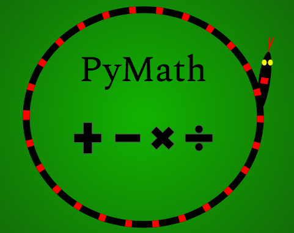

# PyMath
Scripts that calculate values of equations, expressions, and other math related value calculating processes. 
## Instructions
1. Install python 3 using pip, homebrew, or another package manager.
2. Download or clone this this github.
3. Use cd in your command prompt or terminal to get into the directory.
4. If you choose to use your command prompt or terminal as an environment, run your desired file using `python3 FileName.py`

Alternatively, you can execute the code in a different environment.

